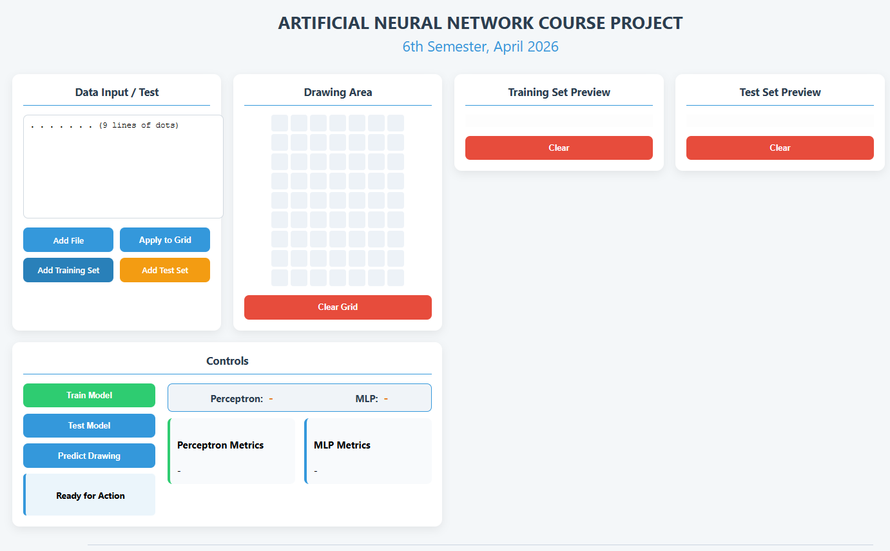
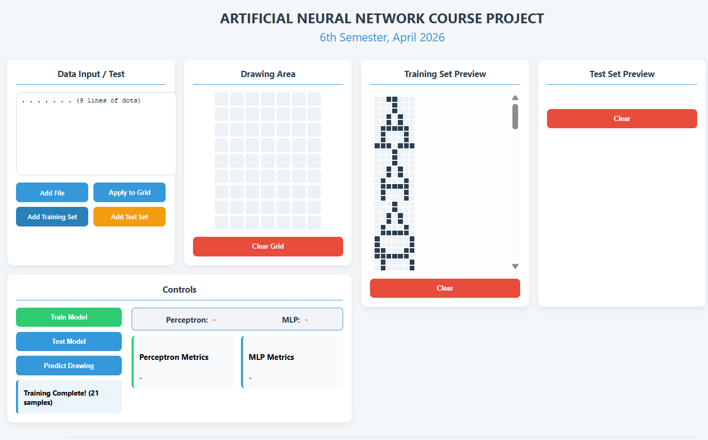
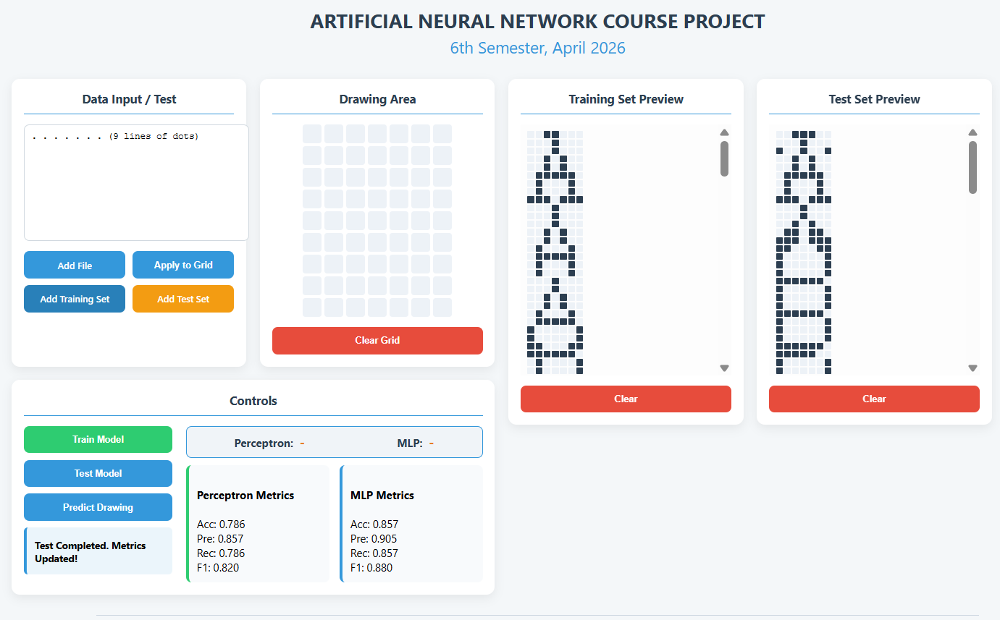
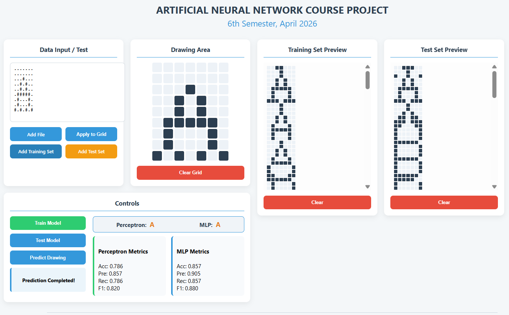
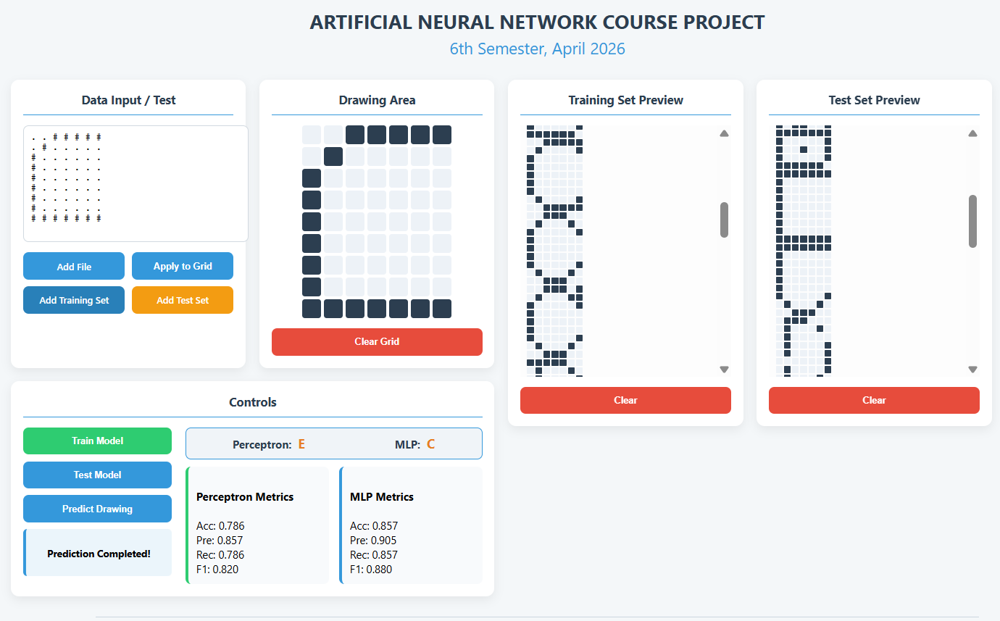

# ANN Course Character Recognition Learning Project

## Overview

This project was developed as part of an Artificial Neural Networks course to gain hands-on experience in neural network design, training, and evaluation.

The system classifies 7 character classes (A, B, C, D, E, J, K) using 9×7 binary pixel matrices. Two different neural network models are implemented and compared:

- Perceptron
- Multi-Layer Perceptron (MLP)

In addition to the machine learning models, a full-stack web application was developed for training, testing, and real-time prediction.

---

## Application Interface

<p align="center">
  
</p>

*Figure 1. Main application interface showing the drawing area, dataset management panel, and model controls.*

---

## Training Process

<p align="center">
 
</p>

*Figure 2. Training datasets are loaded and both Perceptron and MLP models are trained through the Flask backend.*

---


## Testing Process
*Figure 3. Testing datasets are loaded and both Perceptron and MLP models are tested through the Flask backend.*

<p align="center">
 
</p>

---


## Prediction Example

<p align="center">
 
</p>

<p align="center">
 
</p>

*Figures 4–5 show character prediction results produced by Perceptron and MLP models.*

---

## Technologies Used

### Backend
- Python
- Flask
- NumPy

### Frontend
- HTML
- CSS
- JavaScript

### Machine Learning
- Perceptron Learning Algorithm
- Multi-Layer Perceptron (MLP)
- Backpropagation
- tanh activation function

---

## Key Features

- 7-class character recognition system
- 9×7 binary image representation
- Dual model comparison (Perceptron vs MLP)
- Real-time prediction interface
- Dataset upload and preprocessing
- Performance evaluation metrics
- REST API-based architecture

---

## Project Structure

```text
ANN_project/
├── ann.py
├── app.py
├── index.html
├── index.css
├── index.js
├── screenshots/
└── README.md
```

## Learning Objectives

<p> This Project was developed to strength the understanding of: </p>
<ul> 
	<li>Artificial Neural Networks (ANN)</li>
	<li>Perceptron learning algorithm</li>
	<li>MLP & backpropagation</li>
	<li>Model evaluation techniques</li>		
	<li>Full-stack integration</li>
	<li>REST API development with Flas</li>
</ul>

---

## Educational Note

<p> This Project was developed as a learning-oriented implementation during ANN course </p>
<p> External assistance was used in spesific areas: </p>

<ul>
	<li> Flask backend and frontend integration were developed with the support of AI-assisted guidance due to limited prior experience with Flask</li>
	<li> JavaScript-based frontend logic was also implemented with partial AI instance during the learning phase of web development</li>
	<li> AI tools were used for debugging support, code structuring suggestions, and reseolving integration issues between backend and frontend layers</li>
</ul>


<p>All concepts and implementations were examined as a part of learning process of REST API, JavaScript, Flask and CSS
</p>
---